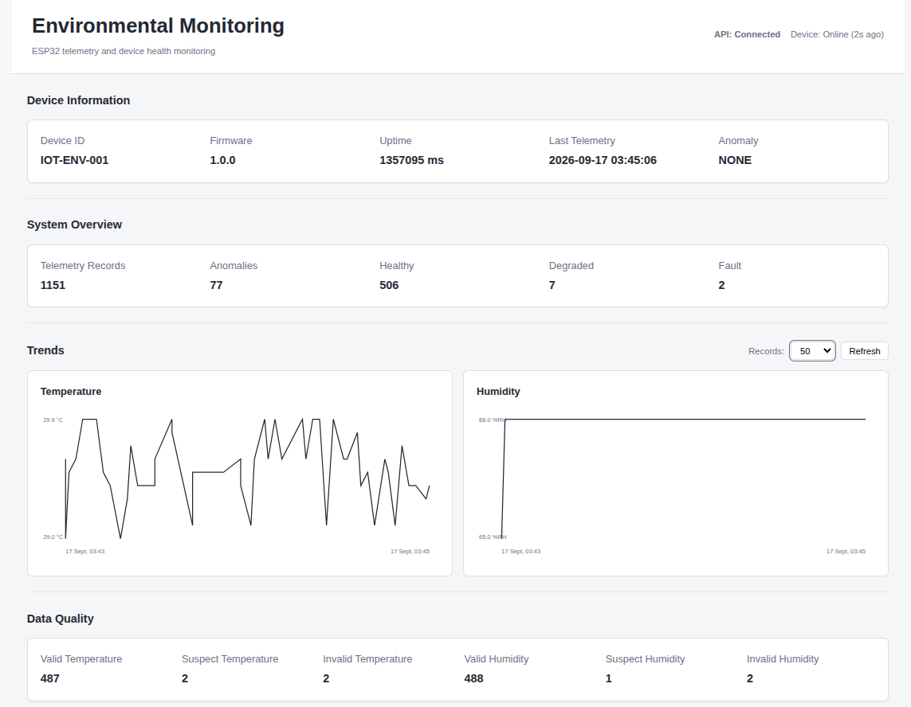

# IoT Environmental Monitoring & Telemetry System

A professional ESP32-based environmental monitoring system designed around reliable telemetry collection, measurement validation, device health monitoring, local persistence, and historical visualization.

The system demonstrates an end-to-end IoT architecture:

ESP32 → HTTP API → SQLite → Web Dashboard

The project focuses on engineering reliability rather than simply collecting sensor readings. Measurements are validated, classified by data quality, associated with device health and anomaly state, buffered when the backend is unavailable, and delivered when connectivity is restored.

## Dashboard

## Overview
The system uses an ESP32 with a DHT11 temperature and humidity sensor to periodically collect environmental measurements.
The firmware is organized into independent components for:
- Sensor abstraction
- Sampling
- Measurement representation
- Measurement validation
- Data quality classification
- Device health evaluation
- Telemetry generation
- Telemetry anomaly detection
- Telemetry buffering
- Reliable telemetry delivery
- Wi-Fi management
- HTTP transport
- Device status
- Operational metrics
- Logging
A Flask backend receives telemetry from the ESP32 and stores it in SQLite.
A browser-based dashboard provides:
- Current environmental measurements
- Device information
- Device connectivity status
- Telemetry history
- Temperature and humidity trends
- Data quality statistics
- Device health statistics
- Anomaly statistics

                         ┌─────────────────────┐
                         │       DHT11         │
                         │ Temperature/Humidity│
                         └──────────┬──────────┘
                                    │
                                    ▼
                         ┌─────────────────────┐
                         │        ESP32        │
                         │                     │
                         │ Sensor              │
                         │ Sampling            │
                         │ Validation          │
                         │ Data Quality        │
                         │ Health              │
                         │ Anomaly Detection   │
                         │ Telemetry           │
                         │ Buffer              │
                         │ Delivery            │
                         └──────────┬──────────┘
                                    │
                              HTTP / JSON
                                    │
                                    ▼
                         ┌─────────────────────┐
                         │     Flask API       │
                         │                     │
                         │ Validation          │
                         │ Telemetry endpoints │
                         │ Device status       │
                         │ Statistics          │
                         └──────────┬──────────┘
                                    │
                                    ▼
                         ┌─────────────────────┐
                         │       SQLite        │
                         │ Historical telemetry│
                         └──────────┬──────────┘
                                    │
                                    ▼
                         ┌─────────────────────┐
                         │   Web Dashboard     │
                         │                     │
                         │ Current state       │
                         │ Device status       │
                         │ Historical trends   │
                         │ Data quality        │
                         │ System statistics   │
                         └─────────────────────┘

## Key Features
Embedded Telemetry Collection
- ESP32-based environmental monitoring
- DHT11 temperature and humidity sensing
- Configurable sampling interval
- Structured JSON telemetry
- Device identification
- Firmware version reporting
- Wi-Fi signal monitoring
Measurement Validation
Sensor measurements are evaluated against configured operating ranges before being included in telemetry.
This allows the system to distinguish between:
- Measurements that are within the expected range
- Measurements that may require investigation
- Measurements that should not be trusted
Data Quality Classification
Measurements are classified as:
- VALID
- SUSPECT
- INVALID
Data quality is tracked independently for temperature and humidity.
Device Health Monitoring
Device state is represented as:
- HEALTHY
- DEGRADED
- FAULT
Device health describes the operational condition of the device and its sensing pipeline.
Anomaly Detection
Telemetry can be marked as anomalous independently from measurement quality and device health.
The system therefore represents three separate dimensions:
DEVICE HEALTH
HEALTHY / DEGRADED / FAULT

DATA QUALITY
VALID / SUSPECT / INVALID

ANOMALY
NONE / DETECTED

Reliable Telemetry Delivery
Telemetry is placed into a fixed-size FIFO buffer before delivery.
The core delivery invariant is:
peek → attempt HTTP

SUCCESS → dequeue
FAILURE → retain
When the backend is unavailable:
- Existing telemetry remains buffered.
- The oldest record is retained until successful delivery.
- The buffer has a fixed capacity.
- Additional records are dropped when the queue is full.
- Transport failures trigger exponential backoff.
- Buffered telemetry is delivered after backend recovery.
Backend Persistence
The Flask backend stores telemetry in SQLite, allowing historical measurements to be queried after transmission.
Web Dashboard
The dashboard provides:
- Latest temperature
- Latest humidity
- Wi-Fi RSSI
- Device health
- Temperature data quality
- Humidity data quality
- Device firmware information
- Device uptime
- Last telemetry timestamp
- Anomaly status
- Telemetry record counts
- Health statistics
- Data quality statistics
- Historical temperature chart
- Historical humidity chart
- Device online/stale status

## Hardware
Main Hardware
- ESP32 development board
- DHT11 temperature/humidity sensor
- Breadboard
- Jumper wires
- USB power/data connection
Sensor Configuration
The current DHT11 configuration uses:
Temperature:
Range: 0°C to 50°C
Unit: °C

Humidity:
Range: 20%RH to 90%RH
Unit: %RH
The DHT11 data pin is configured through the firmware configuration files.

## Firmware Architecture
The firmware follows a modular architecture rather than placing all functionality inside main.cpp.
Important modules include:
Sensor
   │
   ▼
Sampler
   │
   ▼
Measurement
   │
   ├── Validation
   ├── Data Quality
   └── Anomaly Detection
   │
   ▼
Telemetry
   │
   ▼
Telemetry Buffer
   │
   ▼
Telemetry Delivery
   │
   ▼
HTTP Transport
Additional infrastructure includes:
Wi-Fi Manager
Logger
System Status
Device Status
Telemetry Metrics
Configuration
The HTTP transport layer is abstracted through HttpTransport, allowing telemetry delivery logic to be tested independently from the concrete HTTP client.

## Telemetry Pipeline
Each sampling cycle follows approximately this sequence:
1. The sampler determines whether a measurement is due.
2. The sensor produces temperature and humidity readings.
3. Measurements are validated against configured ranges.
4. Data quality is classified.
5. Telemetry anomaly detection is performed.
6. Device health is evaluated.
7. A structured telemetry payload is created.
8. The payload is placed into the telemetry buffer.
9. The delivery component attempts transmission when network connectivity is available.
10. The Flask API validates and stores the telemetry.

## Backend
The backend is implemented using Python and Flask.
Dependencies are defined in:
backend/requirements.txt
The backend provides:
- Telemetry ingestion
- Historical telemetry retrieval
- Latest telemetry retrieval
- Device status
- Health summaries
- Telemetry statistics
- Device-specific telemetry filtering
The backend also performs validation of telemetry quality values and other incoming data.

## Database
SQLite is used for local persistence.
The telemetry database stores information including:
- Record ID
- Device ID
- Firmware version
- Device uptime
- Temperature
- Temperature quality
- Humidity
- Humidity quality
- Wi-Fi RSSI
- Device health
- Anomaly state
- Server receive timestamp
The database layer supports filtering telemetry by device ID.
Database initialization and lightweight schema migration are handled by the backend.

## Dashboard
The dashboard is implemented using:
- HTML
- CSS
- JavaScript
- SVG charts
The frontend communicates exclusively with the Flask API.
Dashboard
    │
    │ HTTP requests
    ▼
Flask API
    │
    ▼
SQLite
The dashboard does not directly access the SQLite database or ESP32.
Dashboard Capabilities
The dashboard displays:
Current State
- Temperature
- Humidity
- Wi-Fi RSSI
- Device health
- Temperature quality
- Humidity quality
- Network quality
Device Information
- Device ID
- Firmware version
- Uptime
- Last telemetry time
- Anomaly status
System Overview
- Total telemetry records
- Detected anomalies
- Healthy records
- Degraded records
- Fault records
Historical Trends
- Temperature history
- Humidity history
- Configurable history size
- Refresh control
Data Quality
- Valid temperature measurements
- Suspect temperature measurements
- Invalid temperature measurements
- Valid humidity measurements
- Suspect humidity measurements
- Invalid humidity measurements
Historical charts only plot valid numeric measurements with valid timestamps.
The dashboard also handles empty historical datasets and malformed API responses without crashing the interface.

## Reliability and Fault Handling
Reliability was treated as a first-class design requirement.
Backend Outage
If the backend becomes unavailable:
ESP32
  │
  ▼
HTTP failure
  │
  ▼
Telemetry retained in buffer
The firmware does not immediately discard telemetry when a transport failure occurs.
Buffer Capacity
The current telemetry buffer has a capacity of:
5 records
When the buffer reaches capacity, additional telemetry is dropped rather than overwriting existing queued records.
Recovery
When the backend becomes available again:
Buffered telemetry
       │
       ▼
Successful delivery
       │
       ▼
Dequeue
       │
       ▼
Next buffered record
This preserves FIFO delivery behavior.
Retry Behavior
Transport failures use exponential backoff with a maximum delay.
This prevents the device from repeatedly attempting requests against an unavailable backend without delay.

## Data Quality
Data quality and device health are intentionally treated as separate dimensions.
For example:
Device:
HEALTHY

Measurement:
SUSPECT
does not automatically mean that the entire device has failed.
This distinction allows the system to represent measurement uncertainty without conflating it with device-level failure.
Testing
The project contains automated firmware and backend test suites.
Firmware Tests
Final firmware test result:
115 test cases
115 succeeded
Backend Tests
Final backend test result:
43 passed
Integration Verification
The complete telemetry path was verified:
DHT11
  ↓
ESP32
  ↓
Validation
  ↓
Telemetry
  ↓
HTTP
  ↓
Flask
  ↓
SQLite
  ↓
Dashboard
The backend outage and recovery scenario was also verified:
Backend unavailable
        ↓
Telemetry buffered
        ↓
Buffer reached capacity
        ↓
Additional records dropped
        ↓
Backend recovered
        ↓
Buffered telemetry delivered
        ↓
Queue drained
        ↓
New telemetry accepted

## Project Structure
IoT_Engineering_Lab/
├── backend/
│   ├── app.py
│   ├── database.py
│   ├── requirements.txt
│   └── tests/
│       ├── test_api.py
│       └── test_database.py
│
├── dashboard/
│   ├── index.html
│   ├── css/
│   │   └── dashboard.css
│   └── js/
│       ├── api.js
│       └── dashboard.js
│
├── include/
│
├── lib/
│   ├── DeviceHealth/
│   ├── DeviceStatus/
│   ├── DHT11Sensor/
│   ├── Measurement/
│   ├── MeasurementValidation/
│   ├── Sampling/
│   ├── Sensor/
│   ├── Telemetry/
│   ├── TelemetryAnomaly/
│   ├── TelemetryBuffer/
│   ├── TelemetryDelivery/
│   └── TelemetryMetrics/
│
├── src/
│   ├── config/
│   ├── device/
│   ├── network/
│   └── main.cpp
│
├── test/
│   ├── test_data_quality/
│   ├── test_device_health/
│   ├── test_dht11_sensor/
│   ├── test_dht11_validation/
│   ├── test_measurement/
│   ├── test_measurement_config/
│   ├── test_measurement_lookup/
│   ├── test_measurement_validation/
│   ├── test_sampler/
│   ├── test_sampling_config/
│   ├── test_sensor/
│   ├── test_sensor_characteristics/
│   ├── test_telemetry/
│   ├── test_telemetry_anomaly/
│   ├── test_telemetry_buffer/
│   ├── test_telemetry_delivery/
│   └── test_telemetry_metrics/
│
├── platformio.ini
└── README.md

## Setup and Installation

Prerequisites
The project requires:
- ESP32 development board
- PlatformIO
- Python 3
- Git
- DHT11 sensor
- Chromium or another modern web browser
Firmware Setup
Clone the repository and enter the project directory:
cd IoT_Engineering_Lab
Build the firmware:
pio run
Run the firmware tests:
pio test
Upload the firmware:
pio run --target upload
Monitor the serial output:
pio device monitor
Backend Setup
Create and activate a Python virtual environment:
cd backend
python3 -m venv .venv
source .venv/bin/activate
Install the backend dependencies:
pip install -r requirements.txt
Start the Flask API:
python app.py
The API listens on:
http://localhost:5000
Dashboard Setup
The dashboard is a static frontend.
From the dashboard directory:
cd dashboard
python3 -m http.server 8000
Open:
http://localhost:8000
The dashboard communicates with the Flask API.

## Configuration
Device configuration is located under:
src/config/
Important configuration values include:
- Device ID
- Device name
- Firmware version
- Sampling interval
- Sensor pins
- Wi-Fi configuration
- Telemetry endpoint
Network Credentials
Local Wi-Fi credentials and the local telemetry endpoint should be stored in:
src/config/network_config.local.h
This file is excluded from Git and should not be committed.
The repository contains:
src/config/network_config.h
as the safe default configuration/template.
Never commit real Wi-Fi credentials or other private configuration values.

## API Endpoints
Health Check
GET /health
Submit Telemetry
POST /api/telemetry
Retrieve Telemetry
GET /api/telemetry
Optional query parameters:
limit
device_id
Retrieve Latest Telemetry
GET /api/telemetry/latest
Optional query parameter:
device_id
Retrieve Health Summary
GET /api/telemetry/health
Retrieve Device Status
GET /api/device/status?device_id=IOT-ENV-001
Retrieve Telemetry Statistics
GET /api/telemetry/stats
Future Improvements
Potential future development includes:
- MQTT transport
- Persistent queue storage on the ESP32
- Multiple sensor nodes
- Additional environmental sensors
- Authentication and authorization
- HTTPS/TLS deployment
- PostgreSQL support for larger deployments
- Device registration and provisioning
- Remote configuration
- More advanced anomaly detection
- Alert notification services
- Historical data export
- Docker-based deployment
- Production monitoring and observability
- Automated CI testing

## License
This project is currently intended as an engineering portfolio and learning project.